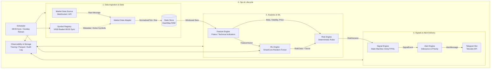
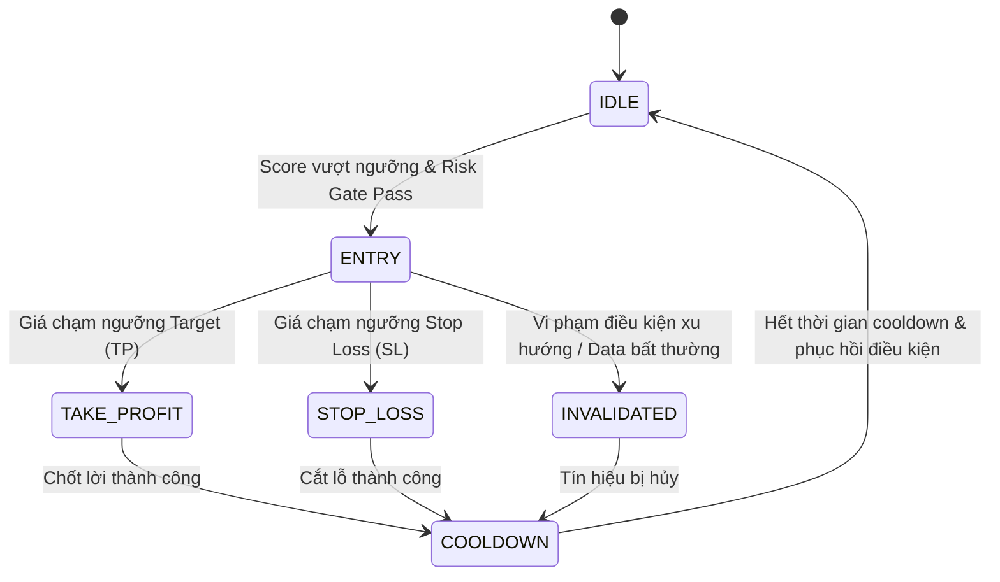
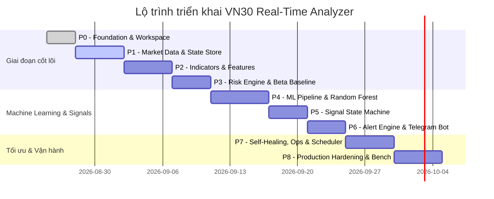

# VN30 Real-Time Analyzer

> **Hệ thống phân tích kỹ thuật và Machine Learning thời gian thực cho 30 cổ phiếu thuộc rổ VN30 viết hoàn toàn bằng 100% Rust.**

---

## 📑 Mục lục
1. [Tổng quan dự án](#1-tổng-quan-dự-án)
2. [Nguyên tắc thiết kế cốt lõi](#2-nguyên-tắc-thiết-kế-cốt-lõi)
3. [Phân loại rủi ro & Baseline mục tiêu](#3-phân-loại-rủi-ro--baseline-mục-tiêu)
4. [Kiến trúc hệ thống & Luồng dữ liệu](#4-kiến-trúc-hệ-thống--luồng-dữ-liệu)
5. [Cấu trúc Cargo Workspace & Chi tiết Module](#5-cấu-trúc-cargo-workspace--chi-tiết-module)
6. [Feature Engineering & Machine Learning](#6-feature-engineering--machine-learning)
7. [Risk Engine & Signal State Machine](#7-risk-engine--signal-state-machine)
8. [Alert Engine & Telegram Bot](#8-alert-engine--telegram-bot)
9. [Cơ chế Self-Healing & Độ tin cậy (Ops)](#9-cơ-chế-self-healing--độ-tin-cậy-ops)
10. [Cấu hình hệ thống (Configuration)](#10-cấu-hình-hệ-thống-configuration)
11. [Lộ trình triển khai (Roadmap) & Definition of Done](#11-lộ-trình-triển-khai-roadmap--definition-of-done)

---

## 1. Tổng quan dự án

**VN30 REAL-TIME ANALYZER** là một hệ thống phân tích thị trường chứng khoán chạy tự chủ 100% bằng ngôn ngữ lập trình **Rust**, tập trung chuyên sâu vào danh mục 30 mã cổ phiếu lớn nhất thị trường chứng khoán Việt Nam (rổ chỉ số **VN30**).

### Phạm vi cốt lõi:
```text
Dữ liệu thị trường (WebSocket/API) 
   ──> Chuẩn hóa & Lưu trữ RAM (DashMap)
   ──> Tính toán chỉ báo kỹ thuật & Trích xuất đặc trưng (Features)
   ──> Phân loại rủi ro & Đánh giá xác suất (SmartCore Random Forest)
   ──> Áp bộ lọc rủi ro & Sinh điểm Entry / TP / SL (Risk & Signal Engine)
   ──> Gửi cảnh báo đa kênh (Telegram Bot / Teloxide)
```

---

## 2. Nguyên tắc thiết kế cốt lõi

* 🚫 **Không tự động đặt lệnh (No Auto-Execution)**: Hệ thống đóng vai trò là trợ lý thông minh phát hiện cơ hội, tính toán rủi ro và gửi tín hiệu khuyến nghị. Quyết định giao dịch thực tế luôn thuộc về người dùng.
* 🦀 **100% Pure Rust Engine**: Toàn bộ luồng production (từ ingest dữ liệu, tính toán ma trận feature, inference mô hình ML đến gửi tin qua Telegram) đều chạy trên runtime Rust thuần túy, loại bỏ hoàn toàn việc gọi subprocess hay bridge sang Python để đạt hiệu năng tối đa và độ trễ cực thấp (< 1-2s).
* 🛡️ **Tự phục hồi (Self-Healing)**: Tự động reconnect WebSocket với exponential backoff & jitter, kiểm tra heartbeat, rollback mô hình khi load lỗi, chống nghẽn bộ nhớ RAM với bounded rolling windows.
* 🔍 **Tính xác định & Auditability**: 100% tín hiệu sinh ra đều được gắn kèm metadata: `model_version`, `config_version`, `feature_timestamp`, cho phép tái hiện chính xác (replay test) mọi quyết định trong quá khứ.

---

## 3. Phân loại rủi ro & Baseline mục tiêu

Hệ thống phân loại cơ hội giao dịch thành 3 nhóm rủi ro:

| Nhóm rủi ro (Risk Class) | Mục tiêu chốt lời (Target / TP) | Mức cắt lỗ (Stop Loss / SL) | Biên độ Beta ($\beta$) | Ghi chú vận hành |
| :--- | :---: | :---: | :---: | :--- |
| 🟢 **Safe** | `+12%` đến `+15%` | `-3%` đến `-4%` | $\beta < 1.0$ | Cổ phiếu biến động thấp hơn thị trường chung, tỷ lệ $R:R \approx 3:1 \to 5:1$ |
| 🟡 **Medium** | `+15%` đến `+18%` | `-5%` đến `-6%` | $1.0 \le \beta \le 1.25$ | Cổ phiếu đồng pha với biến động thị trường |
| 🔴 **Risky** | `+20%` đến `+25%` | `-7%` đến `-8%` | $\beta > 1.25$ | Cổ phiếu beta cao, biến động mạnh, tiềm năng tăng trưởng lớn nhưng rủi ro cao |

> **Lưu ý**: Các mức Target/SL và Beta trên là cấu hình khởi đầu (Baseline) phục vụ kiểm thử và backtest, có thể tùy chỉnh động qua file `config.toml`.

---

## 4. Kiến trúc hệ thống & Luồng dữ liệu

Hệ thống được thiết kế theo mô hình **Event-Driven Architecture** với các module tách rời, giao tiếp thông qua các typed messages và in-memory channels (Tokio mpsc/broadcast).



### Luồng sự kiện tuần tự:
1. `MarketData` nhận dữ liệu tick/bar -> giải mã (parse) và chuẩn hóa về `NormalizedTick`/`Bar`.
2. `StateStore` cập nhật giá hiện tại, sổ lệnh và rolling window (giới hạn $N$ bars) trên RAM bằng `DashMap`.
3. `FeatureEngine` tính toán tức thời các chỉ báo kỹ thuật (RSI, MACD, Bollinger Bands, Beta, Volatility,...) và đóng gói thành `FeatureVector`.
4. `MLEngine` thực hiện dự đoán (inference) phân loại `RiskClass` cùng xác suất tin cậy (`score/confidence`).
5. `RiskEngine` áp dụng các quy tắc kiểm tra an toàn (dữ liệu stale? biến động bất thường? vi phạm rule?).
6. `SignalEngine` kích hoạt chuyển đổi trạng thái tín hiệu (`ENTRY` -> `TAKE_PROFIT` / `STOP_LOSS` / `INVALIDATED`).
7. `AlertEngine` lọc trùng (debounce), gán mức độ ưu tiên (`CRITICAL`, `HIGH`, `INFO`) và đẩy tin nhắn vào hàng đợi của `TelegramBot`.

---

## 5. Cấu trúc Cargo Workspace & Chi tiết Module

Dự án được phân chia thành các sub-crate chuyên biệt:

```text
vn30-analyzer/
├── Cargo.toml                 # Root Workspace configuration
├── config/
│   └── config.toml            # File cấu hình chung cho runtime, rủi ro, kết nối
├── models/
│   └── rf_active.bin          # Model artifact đã được serialize (SmartCore)
├── tests/
│   ├── integration_tests.rs   # Kiểm thử tích hợp toàn pipeline
│   └── replay_harness.rs      # Replay dữ liệu lịch sử để kiểm thử tính xác định
├── crates/
│   ├── domain/                # Các struct lõi: Tick, Bar, FeatureVector, SignalEvent,...
│   ├── market-data/           # WebSocket Client, auto-reconnect, deserializer
│   ├── symbol-registry/       # Quản lý 30 mã VN30, lịch đồng bộ 08:00, mapping ticker
│   ├── state-store/           # Bộ nhớ RAM DashMap, quản lý rolling windows và session state
│   ├── indicators/            # Thuật toán thuần Rust tính RSI, MACD, Bollinger, ATR, Beta,...
│   ├── features/              # Feature matrix extractor kết hợp Polars
│   ├── ml/                    # SmartCore wrapper: training, inference, hot-swap model
│   ├── risk/                  # Risk gating rules, so khớp Beta band và Target/SL
│   ├── signals/               # State machine quản lý vòng đời tín hiệu
│   ├── alerts/                # Bộ lọc debounce, rate-limiting, template message
│   ├── telegram/              # Teloxide bot client, xử lý commands (/status, /health,...)
│   ├── storage/               # Ghi log audit, lưu trữ snapshot bar (Parquet/SQLite)
│   ├── scheduler/             # Lập lịch định kỳ (08:00 sync, Chủ Nhật retrain)
│   ├── observability/         # Tracing JSON logs, đo lường latency, metrics
│   └── app/                   # Binary khởi động chính (Composition Root)
```

### Bảng tóm tắt nhiệm vụ các crate:

| Crate | Trách nhiệm chính | Input | Output |
| :--- | :--- | :--- | :--- |
| `domain` | Định nghĩa toàn bộ schema dữ liệu và validation rules | — | Các kiểu dữ liệu thuần Rust |
| `market-data` | Kết nối WebSocket, quản lý heartbeat, reconnect, parse JSON/Binary | Raw provider stream | `NormalizedTick`, `Bar` |
| `symbol-registry` | Quản lý danh mục 30 mã VN30 và trạng thái hoạt động | Cấu hình / Sync API | `SymbolMeta`, `BasketVersion` |
| `state-store` | Lưu trữ trạng thái thời gian thực và rolling window trên RAM | `NormalizedTick` / `Bar` | `LatestState`, `WindowSlice` |
| `indicators` | Tính toán chỉ báo kỹ thuật hiệu năng cao | Mảng giá / khối lượng | Giá trị chỉ báo + Validity flag |
| `features` | Trích xuất vector đặc trưng $X_t$ | Window bars & indicators | `FeatureVector` |
| `ml` | Inference thời gian thực & huấn luyện Random Forest định kỳ | `FeatureVector` | `Prediction (Class, Score)` |
| `risk` | Cổng kiểm tra an toàn (Risk Gating) và phân bổ TP/SL | `Prediction`, `Beta`, `Price` | `RiskDecision` |
| `signals` | Quản lý vòng đời tín hiệu giao dịch (State Machine) | `RiskDecision`, Market State | `SignalEvent` |
| `alerts` | Lọc nhiễu, chống spam tin nhắn (Debounce), định dạng tin | `SignalEvent` | `AlertMessage` |
| `telegram` | Kết nối Telegram Bot API qua Teloxide, phân quyền Allowlist | `AlertMessage` / Commands | Tin nhắn Telegram tới người dùng |
| `scheduler` | Điều phối các tác vụ chạy theo lịch (08:00 AM, Chủ Nhật) | Lịch hệ thống | Kích hoạt các Job tương ứng |
| `observability` | Đo đạc độ trễ, ghi log có cấu trúc, health check | Events từ mọi module | Metrics / JSON Logs |
| `storage` | Lưu trữ nhật ký quyết định và lịch sử thị trường phục vụ audit | Domain Events | Persistent Files / Parquet |
| `app` | Điểm khởi đầu khởi chạy ứng dụng (main binary) | CLI args, ENV, `config.toml` | Running Service |

---

## 6. Feature Engineering & Machine Learning

### 6.1. Nhóm chỉ báo kỹ thuật & Đặc trưng (Features v1)
* **Xu hướng (Trend)**: SMA (10, 20, 50), EMA (12, 26), Slope của MA, Khoảng cách tương đối $Price / MA$.
* **Động lượng (Momentum)**: RSI (14), MACD (12, 26, 9), MACD Signal, MACD Histogram.
* **Biến động (Volatility)**: ATR (14), Rolling Standard Deviation, Bollinger Bands Width & %B.
* **Khối lượng (Volume)**: Tỷ lệ Volume so với MA20 Volume, Volume Z-Score.
* **Lợi suất (Returns)**: Lợi suất trượt $1, 3, 5, 10, 20$ nến gần nhất.
* **Quan hệ thị trường**: Beta ($\beta$) so với chỉ số VN30 / VN-Index, Lợi suất tương đối so với VN30.

### 6.2. Tính toán Beta ($\beta$)
$$\beta = \frac{\operatorname{Cov}(R_{\text{cổ phiếu}}, R_{\text{VN30}})}{\operatorname{Var}(R_{\text{VN30}})}$$
* Lookback window: $60 \to 120$ quan sát gần nhất.
* Yêu cầu tối thiểu: $\ge 30$ mẫu dữ liệu hợp lệ. Nếu thiếu dữ liệu $\to$ Đánh dấu Beta Unavailable (không sinh tín hiệu).

### 6.3. Mô hình Machine Learning (SmartCore Random Forest)
* **Phân loại**: Random Forest Classifier thuần Rust (`smartcore::ensemble::random_forest_classifier`).
* **Tránh Data Leakage**:
  * Đặc trưng tại thời điểm $t$ chỉ dùng dữ liệu lịch sử $\le t$.
  * Nhãn (Label) cho mẫu $t$ được gán từ diễn biến tương lai $t+H$ (với $H$ là horizon chốt trước).
  * Chia tập dữ liệu theo thứ tự thời gian (**Time-based split**), tuyệt đối không dùng Random Split.
* **Cơ chế Hot-Swap không gián đoạn**:
  * Mô hình mới được huấn luyện vào Chủ Nhật ở tiến trình nền (background).
  * Kiểm tra validation & schema tương thích $\to$ Đổi con trỏ `Arc<RandomForestClassifier>` một cách atomic mà không cần dừng hệ thống.
  * Tự động rollback phiên bản mô hình cũ nếu health check thất bại.

---

## 7. Risk Engine & Signal State Machine

### 7.1. Cổng kiểm soát rủi ro (Risk Gating Rules)
Risk Engine hoạt động dựa trên các nguyên tắc bất di bất dịch:
1. **Data Freshness Gate**: Nếu dữ liệu bị stale ($t_{\text{now}} - t_{\text{last\_tick}} > \text{threshold}$) $\to$ Chặn sinh tín hiệu.
2. **Missing Indicator Gate**: Nếu bất kỳ chỉ báo chính nào chứa giá trị `NaN` hoặc thiếu dữ liệu $\to$ Chặn sinh tín hiệu.
3. **Volatility & Spread Gate**: Nếu độ biến động vượt quá ngưỡng an toàn hoặc giãn spread lớn $\to$ Chặn sinh tín hiệu.
4. **Market Session Gate**: Chỉ kích hoạt tín hiệu trong phiên khớp lệnh liên tục (Continuous Trading).

### 7.2. Vòng đời tín hiệu (State Machine)



---

## 8. Alert Engine & Telegram Bot

Sử dụng thư viện **Teloxide** để tích hợp trực tiếp Telegram Bot API:

### 8.1. Định dạng tin nhắn cảnh báo mẫu
```text
🚨 [VN30 SIGNAL] - TCB (Techcombank)
━━━━━━━━━━━━━━━━━━━━
🎯 Tín hiệu: ENTRY (Mua)
📊 Nhóm rủi ro: 🟢 Safe (Beta: 0.85)
💵 Giá kích hoạt: 24,500 VND
🎯 Mục tiêu (TP): 27,500 VND (+12.2%)
🛑 Cắt lỗ (SL): 23,600 VND (-3.7%)
📈 Điểm tin cậy (ML Score): 0.87 (Model v1.0.4)
⏱ Thời gian: 10:15:32 24/08/2026
━━━━━━━━━━━━━━━━━━━━
⚠️ Khuyến nghị: Đây là tín hiệu tham khảo từ hệ thống phân tích. Không phải lời khuyên đầu tư tự động.
```

### 8.2. Bộ lệnh Bot tương tác (Telegram Commands)
Hệ thống chỉ phản hồi các lệnh từ danh sách chat ID được phân quyền (**Allowlist**):
* `/status` : Báo cáo trạng thái kết nối WebSocket, độ trễ và số mã đang theo dõi.
* `/health` : Báo cáo sức khỏe hệ thống (RAM, CPU, Uptime, Cache depth).
* `/model` : Thông tin phiên bản mô hình ML đang kích hoạt và chỉ số đánh giá.
* `/signals` : Danh sách các tín hiệu đang theo dõi (Active Positions).
* `/help` : Hướng dẫn sử dụng các lệnh của Bot.

---

## 9. Cơ chế Self-Healing & Độ tin cậy (Ops)

| Sự cố | Cách phát hiện | Cơ chế tự phục hồi (Self-Healing) | Cấp độ cảnh báo |
| :--- | :--- | :--- | :---: |
| **Mất kết nối WebSocket** | Lỗi I/O Socket hoặc timeout Heartbeat (Ping/Pong) | Tự động kết nối lại (Exponential Backoff + Jitter) và đăng ký lại danh sách 30 mã VN30 | `CRITICAL` nếu retry quá 5 lần |
| **Mã cổ phiếu bị mất dữ liệu (Stale)** | $now - t_{\text{tick}} > 60s$ trong giờ giao dịch | Đánh dấu symbol `STALE`, tạm dừng sinh tín hiệu cho riêng mã đó | `HIGH` |
| **Lỗi tải mô hình ML mới** | Không khớp Checksum / Schema đặc trưng | Hủy cập nhật, giữ nguyên mô hình phiên bản cũ và ghi log chi tiết | `CRITICAL` |
| **Telegram API nghẽn/lỗi** | HTTP Error 429 hoặc Request Timeout | Đưa tin nhắn vào hàng đợi (Retry Queue) với backoff | `HIGH` |
| **Tràn bộ nhớ RAM** | Giám sát dung lượng DashMap vượt ngưỡng | Giới hạn dung lượng rolling window cố định ($N$ bars gần nhất), loại bỏ dữ liệu cũ (FIFO) | `CRITICAL` |

---

## 10. Cấu hình hệ thống (Configuration)

Cấu hình được quản lý qua file `config/config.toml` và các biến môi trường:

```toml
[server]
environment = "production"
log_level = "info"

[market_data]
provider = "SSI_FASTCONNECT" # Hoặc VNDIRECT, VPS, SIMULATOR
ws_endpoint = "wss://api.provider.vn/stream"
reconnect_initial_backoff_ms = 1000
reconnect_max_backoff_ms = 30000
heartbeat_interval_secs = 15

[basket]
sync_time = "08:00:00"
symbols = [
    "ACB", "BCM", "BID", "BVH", "CTG", "FPT", "GAS", "GVR", "HDB", "HPG",
    "MBB", "MSN", "MWG", "PLX", "POW", "SAB", "SHB", "SSB", "SSI", "STB",
    "TCB", "TPB", "VCB", "VHM", "VIB", "VIC", "VJC", "VNM", "VPB", "VRE"
]

[model]
artifact_path = "models/rf_active.bin"
retrain_cron = "0 0 2 ? * SUN" # 02:00 sáng Chủ Nhật hàng tuần
min_confidence_score = 0.75

[risk.safe]
target_min = 0.12
target_max = 0.15
sl_min = -0.04
sl_max = -0.03
beta_max = 1.0

[risk.medium]
target_min = 0.15
target_max = 0.18
sl_min = -0.06
sl_max = -0.05
beta_min = 1.0
beta_max = 1.25

[risk.risky]
target_min = 0.20
target_max = 0.25
sl_min = -0.08
sl_max = -0.07
beta_min = 1.25

[telegram]
bot_token_env = "TELEGRAM_BOT_TOKEN"
chat_allowlist = ["123456789", "987654321"]
debounce_cooldown_mins = 60
```

---

## 11. Lộ trình triển khai (Roadmap) & Definition of Done

### 11.1. Các giai đoạn phát triển (Phases)



* **P0 - Foundation**: Tạo Cargo workspace, các crate domain types, nạp config TOML, chuẩn hóa JSON logging với `tracing`.
* **P1 - Market Data**: WebSocket adapter với cơ chế tự động reconnect, ingest dữ liệu 30 mã và lưu trữ vào `DashMap`.
* **P2 - Indicators**: Xây dựng bộ chỉ báo kỹ thuật (RSI, MACD, Bollinger, ATR,...) được kiểm thử unit test độc lập.
* **P3 - Risk Engine**: Tính toán Beta thời gian thực, thiết lập các bộ lọc an toàn và mapping tỷ lệ TP/SL.
* **P4 - ML Engine**: Huấn luyện SmartCore Random Forest, xuất/nhập binary artifact, triển khai hot-swap.
* **P5 - Signals**: Hoàn thiện State Machine quản lý vòng đời tín hiệu từ khi Mua đến khi Đóng/Hủy.
* **P6 - Telegram**: Tích hợp Teloxide bot, chống spam bằng cơ chế Debounce, hỗ trợ các lệnh tương tác.
* **P7 - Self-Healing & Ops**: Tích hợp Scheduler (08:00 sync, Chủ Nhật train), xử lý sự cố mạng/mô hình tự động.
* **P8 - Production Hardening**: Chạy Replay test với dữ liệu lịch sử, benchmark tải trên 30 mã, kiểm tra rò rỉ bộ nhớ.

---

### 11.2. Tiêu chuẩn hoàn thành toàn diện (Definition of Done)
1. ✅ Hệ thống nhận và duy trì dữ liệu thời gian thực của toàn bộ 30 mã VN30 mà không mất trạng thái khi reconnect.
2. ✅ 100% chỉ báo kỹ thuật và ma trận đặc trưng vượt qua bộ kiểm thử Unit Tests và Replay Tests.
3. ✅ Mô hình Random Forest có quản lý phiên bản dataset, model artifact, tránh hoàn toàn rò rỉ dữ liệu (data leakage).
4. ✅ Risk Engine đưa ra quyết định có tính xác định (Deterministic) và có thể kiểm tra lại (Audit Trail).
5. ✅ Telegram Bot gửi cảnh báo kịp thời (độ trễ $\le 1-2\text{s}$), không spam và phản hồi chính xác các lệnh quản trị.
6. ✅ Đạt tiêu chuẩn an toàn: Tuyệt đối không có module tự động đặt lệnh (No Auto-Execution).
